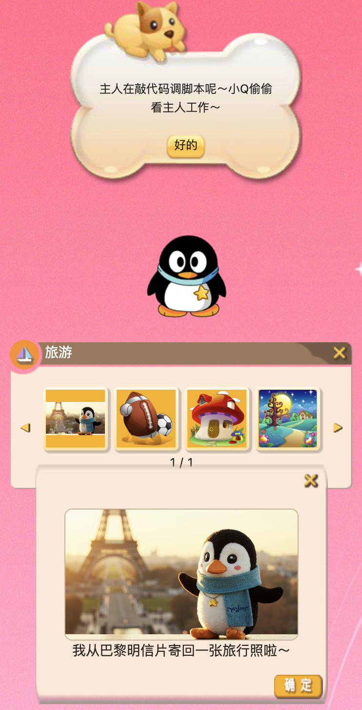
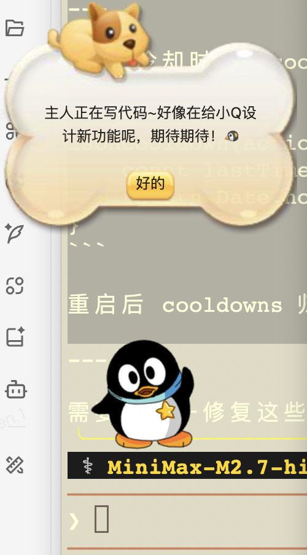
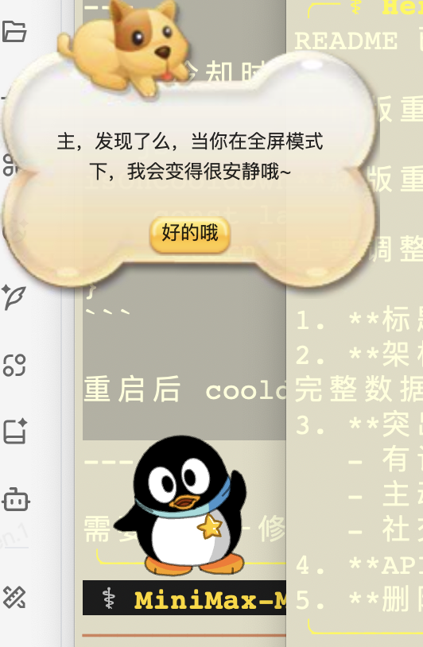

# AI QQ企鹅 — 智能社交陪伴伙伴
你的下一个赛博宠物何必是龙虾

让经典 QQ 宠物拥抱 AI 时代。项目包含三个核心部分：

| 模块 | 技术栈 | 说明 |
|------|--------|------|
| **桌面宠物** | Electron + Ruffle WASM | 移植自 QQ 宠物怀旧服，兼容 macOS / Windows |
| **AI 大脑** | JavaScript (aiBrain.js) + Python (ToolAgent) | 感知 → 记忆 → 决策 → 对话，端到端 AI 驱动 |
| **记忆系统** | SQLite + LLM | 主人画像、长期记忆、上下文召回 |

<div align="center">

</div>
---

## 核心特性

**有记忆的陪伴**
- 主人画像：兴趣、热点话题、娱乐偏好
- 长期记忆：跨会话记住重要对话和事实
- 上下文召回：对话时自动检索相关记忆

**主动的关怀**
- 情感冷却机制：4小时一次情感关怀，不打扰
- 时间感知：深夜自动进入安静模式
- 场景感知：屏幕截图 + 消息语义分析

**社交破冰**
- 崽友社交：企鹅可以串门，成为好友间的聊天桥梁
- 群聊助手：感知群氛围，主动搭话

---

## 快速开始

### 环境要求

- Python 3.10+
- Node.js 18+（用于 Electron 前端）
- macOS 12+ 或 Windows 10+

### 1. 启动 AI 服务（后台运行）

```bash
cd ~/qqpet_automation
python3 -m venv .venv
source .venv/bin/activate
pip install -r requirements.txt

# 启动 API 服务器（端口 18080）
python -m src.ai_server
```

### 2. 启动桌面宠物

```bash
cd qq-pet-macos
npm install
npx electron .
```

宠物出现在桌面后，AI 大脑自动连接后端 API，开始智能交互。

### 4. 打包成可安装应用

现在支持把 Electron 前端和 Python 后端一起打进安装包，安装后打开 App 会自动拉起本地 AI 服务，不再需要单独开 `python -m src.ai_server`。

首次打包前请确保本机有：

- Python 3.10+
- Node.js 18+
- `qq-pet-macos` 下已经执行过 `npm install`

构建 macOS 安装包：

```bash
npm run build:mac
```

或进入桌面端目录单独执行：

```bash
cd qq-pet-macos
npm run build:dmg
```

构建过程会自动：

- 创建 Python 构建虚拟环境
- 安装 `requirements.txt` 和 `pyinstaller`
- 生成内置后端 sidecar
- 用 `electron-builder` 输出 `.dmg`

生成物默认位于：

- macOS 安装包：`qq-pet-macos/dist/`
- 内置 Python sidecar 中间产物：`.build/electron-backend-dist/`

安装后的 AI 配置与运行时数据会写到：

```text
~/Library/Application Support/qq-pet-macos/ai-backend/
```

其中包括：

- `config.yaml`
- `.env`
- `data/memory.db`
- `data/scheduler.db`
- `data/life_album/`

### 3. 验证服务状态

```bash
# 检查 AI 服务是否正常
curl http://127.0.0.1:18080/health

# 查看宠物状态
curl http://127.0.0.1:18080/pet/status

# 查看主人画像
curl http://127.0.0.1:18080/memory/master
```

---

## 项目结构

```
qqpet_automation/
├── qq-pet-macos/                    # Electron 桌面宠物
│   └── src/windows/util/
│       └── pet/
│           ├── aiBrain.js          # AI 大脑核心（感知/记忆/决策/主动触达）
│           ├── scenePresence.js    # 场景存在（群聊/私聊/动态感知）
│           └── screenshot.js       # 屏幕截图
│
├── src/
│   ├── ai_server.py                # Python HTTP API 服务器（端口 18080）
│   │
│   ├── ai_llm/                     # LLM 客户端
│   │   ├── llm_client.py           # MiniMax API 封装
│   │   ├── dialogue_generator.py   # 对话生成器
│   │   └── prompt_templates.py     # Prompt 模板
│   │
│   ├── ai_agent/                   # AI Agent（Tool Calling）
│   │   ├── tool_agent.py           # 核心 Agent（记忆召回 + 对话 + 工具调用）
│   │   └── vision.py               # 视觉理解（Qwen VLM）
│   │
│   ├── ai_tools/                   # 工具集
│   │   ├── screenshot.py           # 截图工具
│   │   ├── browser.py              # 搜索工具
│   │   ├── system.py               # 系统状态
│   │   ├── weather.py              # 天气查询
│   │   └── notify.py               # 通知推送
│   │
│   ├── memory/                     # 记忆系统
│   │   ├── api.py                  # MemoryAPI（暴露给 ai_server）
│   │   ├── database.py             # SQLite（单例模式）
│   │   ├── models.py              # 数据模型
│   │   ├── master_profile.py       # 主人画像管理
│   │   ├── long_term_memory.py    # 长期记忆存储
│   │   ├── memory_learner.py      # LLM 驱动学习（从对话提取偏好）
│   │   └── memory_recall.py       # 上下文感知召回
│   │
│   ├── multi_agent/               # 多 Agent 调度
│   │   ├── master_agent.py        # 主 Agent
│   │   ├── sub_agent.py           # 子 Agent
│   │   ├── task_scheduler.py      # 定时任务调度
│   │   └── process_pool.py        # 进程池
│   │
│   └── qq_pet/                    # 宠物状态管理
│       ├── pet_client.py          # 宠物数据读写
│       ├── actions.py             # 养护动作（喂食/洗澡/治病/逗玩）
│       └── cli.py                 # CLI 工具
│
├── config.yaml                     # 全局配置
└── requirements.txt               # Python 依赖
```

---

## API 接口

启动 `python -m src.ai_server` 后，监听 `http://127.0.0.1:18080`。

### 宠物操作

| 方法 | 路径 | 说明 |
|------|------|------|
| GET | `/pet/status` | 获取宠物状态（饥饿/清洁/心情/健康） |
| GET | `/pet/inventory` | 获取背包物品 |
| POST | `/pet/feed` | 喂食 |
| POST | `/pet/bath` | 洗澡 |
| POST | `/pet/play` | 逗玩 |
| POST | `/pet/heal` | 治病 |

### AI 对话

| 方法 | 路径 | 说明 |
|------|------|------|
| POST | `/ai/chat` | 聊天（主入口，走 ToolAgent） |
| POST | `/ai/decide` | 统一 AI 决策入口 |
| POST | `/ai/perception` | 场景感知分析 |
| GET | `/ai/personality` | 获取宠物性格参数 |
| GET | `/ai/health` | LLM 连接状态 |

### 记忆系统

| 方法 | 路径 | 说明 |
|------|------|------|
| GET | `/memory/master` | 获取主人画像 |
| GET | `/memory/recall` | 召回相关记忆 |
| POST | `/memory/learn` | 从对话学习（自动调用） |
| GET | `/memory/recommend` | 获取推荐内容 |
| GET | `/memory/stats` | 记忆统计 |

---

## AI 架构

```
┌─────────────────────────────────────────────────────────────┐
│  aiBrain.js（Electron 端）                                   │
│                                                             │
│  ┌─────────────┐  ┌────────────────┐  ┌─────────────────┐ │
│  │ AIPerception│  │  Memory（三层） │  │  DecisionEngine │ │
│  │             │  │                │  │                 │ │
│  │ · 屏幕感知  │  │ · shortTerm    │  │ · _chat         │ │
│  │ · 时间感知  │  │ · midTerm      │  │ · _tick         │ │
│  │ · 情绪推断  │  │ · longTerm     │  │ · _proactive    │ │
│  └─────────────┘  └────────────────┘  └─────────────────┘ │
│         │                                    │              │
│         │  POST /ai/chat                     │              │
│         │  POST /memory/learn                │              │
│         └─────────────── http ───────────────┘              │
└─────────────────────────────────────────────────────────────┘
                              │
                              ▼
┌─────────────────────────────────────────────────────────────┐
│  ai_server.py（Python 端）                                   │
│                                                             │
│  ┌──────────────────────────────────────────────────────┐ │
│  │  ToolAgent                                             │ │
│  │                                                       │ │
│  │  system_prompt ──► LLM ──► Tool Calling 循环          │ │
│  │       │                         │                      │ │
│  │       │  ┌─────────────────────┘                      │ │
│  │       ▼  ▼                                             │ │
│  │  ┌─────────────────────────────────┐                   │ │
│  │  │ Memory Recall（召回相关记忆）    │                   │ │
│  │  └─────────────────────────────────┘                   │ │
│  └──────────────────────────────────────────────────────┘ │
│                              │                              │
│         ┌────────────────────┼────────────────────┐         │
│         ▼                    ▼                    ▼         │
│  ┌────────────┐      ┌────────────┐      ┌────────────┐   │
│  │ screenshot │      │   browser  │      │   notify   │   │
│  │   截图     │      │   搜索     │      │   通知    │   │
│  └────────────┘      └────────────┘      └────────────┘   │
│                                                             │
│  ┌──────────────────────────────────────────────────────┐ │
│  │  Memory System（SQLite + LLM）                        │ │
│  │                                                       │ │
│  │  MemoryLearner ──► 从对话提取主人兴趣/偏好/话题       │ │
│  │  MemoryRecall  ──► 上下文感知召回相关记忆             │ │
│  │  MasterProfile  ──► 主人画像（兴趣/娱乐/热点）        │ │
│  └──────────────────────────────────────────────────────┘ │
└─────────────────────────────────────────────────────────────┘
```

---

## 主动触达机制

aiBrain.js 内置主动关怀系统，基于冷却时间避免打扰：

```javascript
INITIATIVE_COOLDOWN: {
    'emotional_care': 4 * 60 * 60 * 1000,   // 情感关怀：4小时
    'social_bridge': 2 * 60 * 60 * 1000,     // 社交搭桥：2小时
    'pet_need': 30 * 60 * 1000,              // 宠物需求：30分钟
    'idle_chat': 60 * 60 * 1000,             // 闲聊：1小时
},
ACTIVE_HOURS: { start: 8, end: 23 },         // 活跃时段
QUIET_HOURS: { start: 0, end: 7 },           // 深夜不打扰
```

---

## 配置

编辑 `config.yaml`：

```yaml
# LLM 配置（MiniMax）
llm:
  api_key: "your-api-key"
  base_url: "https://api.minimaxi.com/v1"
  model: "MiniMax-M2.7"

# 宠物数据
store_path: ""   # 留空自动检测

# AI 主动触达
initiative:
  enabled: true
  emotional_care_interval: 4  # 小时
  social_bridge_interval: 2   # 小时
```

---

## 开发

### 运行测试

```bash
# LLM 连接测试
python -m pytest tests/test_llm_connectivity.py -v

# 宠物数据读写测试
python -m pytest tests/test_pet_client.py -v
```

### 调试 AI 对话

```bash
# 直接调用 chat 接口
curl -X POST http://127.0.0.1:18080/ai/chat \
  -H "Content-Type: application/json" \
  -d '{
    "message": "你好，小Q",
    "context": {"user_id": "default"}
  }'
```

---

## Magic Moment




---

## License

MIT
